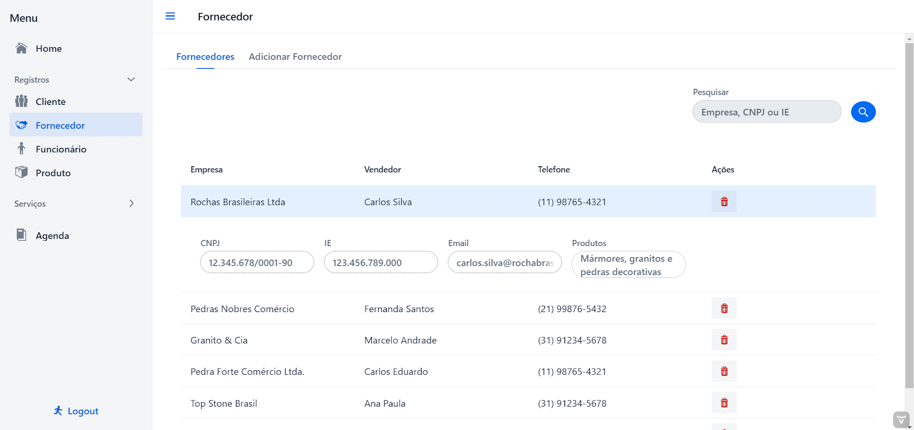
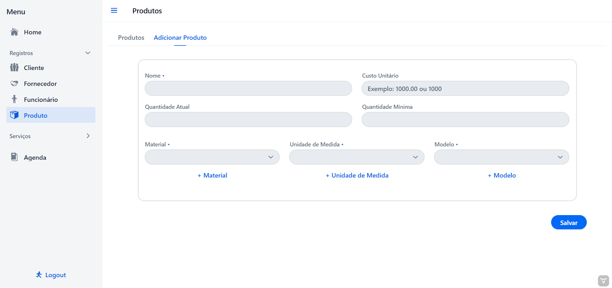
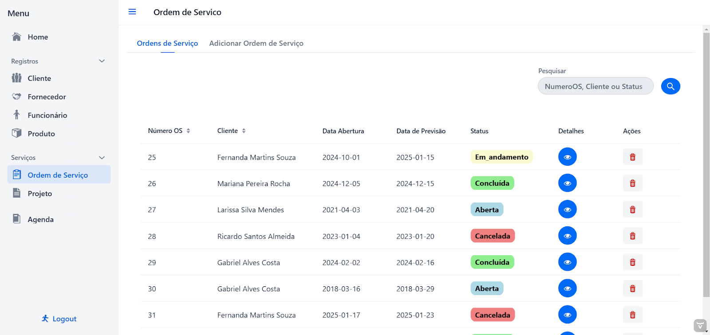

# Sistema de Gerenciamento para Marmorarias

Este é um software web desenvolvido para o gerenciamento de marmorarias, com foco na administração operacional. O sistema foi construído com Java e o framework Vaadin para a interface de usuário, como parte do Trabalho de Conclusão de Curso (TCC). O objetivo principal é facilitar o controle das operações e oferecer uma visão clara do negócio.

---

## Funcionalidades

- **Dashboard inicial com:**
  - Ordens de serviço do dia
  - Tarefas agendadas
  - Produtos com baixo estoque

- **CRUD completo de:**
  - Ordens de serviço
  - Projetos
  - Produtos
  - Tarefas agendadas
  - Clientes
  - Fornecedores
  - Funcionários

---
 
## Tecnologias Utilizadas

- Java 17
- Spring Boot
- Vaadin
- MySQL
- Maven

---

## Demonstração em Vídeo

Assista ao vídeo demonstrativo do sistema em funcionamento:
[https://youtu.be/ikaWbtQyMxw](https://youtu.be/ikaWbtQyMxw)

---

## Imagens do Sistema

Abaixo estão algumas imagens demonstrativas do software.

### Dashboard Inicial


### Fornecedores


### Produto


### Ordens de Serviço


---

## 📁 Estrutura do Projeto

```
structura/
|
├── .mvn/
│   └── wrapper/
├── .vscode/
├── database/
│   └── schema.sql
├── docs/
├── src/
│   └── main/
├── .gitignore
├── LICENSE.md
├── README.md
├── mvnw / mvnw.cmd
├── package.json / package-lock.json
├── pom.xml
├── tsconfig.json
├── types.d.ts
└── vite.config.ts
```

---

## Como Executar

O projeto é um projeto Maven padrão. Para executá-lo a partir do terminal, digite `mvnw` (Windows) ou `./mvnw` (Mac & Linux), e depois abra http://localhost:8080 no navegador.
Você também pode importar o projeto para a IDE de sua preferência, como faria com qualquer projeto Maven.

## Banco de Dados

O script para criar o banco está disponível na pasta [`/database`](./database/schema.sql).
Você pode importar esse arquivo em qualquer MySQL local ou container para rodar o projeto corretamente.

## Build para Produção

Para gerar um build de produção, execute `mvnw clean package -Pproduction` (Windows) ou `./mvnw clean package -Pproduction` (Mac & Linux). Isso criará um arquivo JAR com todas as dependências e recursos do front-end, pronto para ser implantado. O arquivo estará disponível na pasta `target` após a conclusão da build.

Depois que o arquivo JAR for gerado, você pode executá-lo com o comando
`java -jar target/myapp-1.0-SNAPSHOT.jar`
(Obs.: substitua `myapp-1.0-SNAPSHOT.jar` pelo nome correto do seu JAR).

---

## Licença
Este projeto está licenciado sob a Creative Commons BY-NC 4.0.
