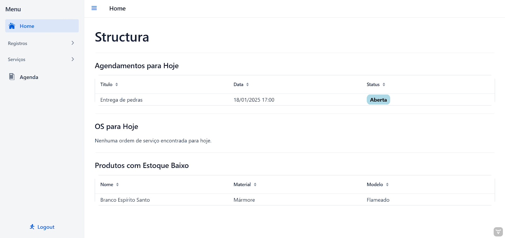
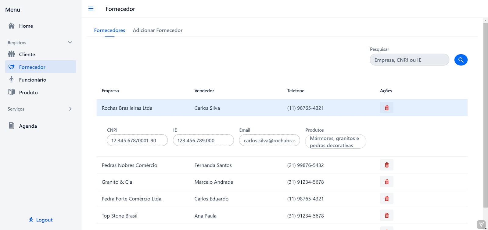
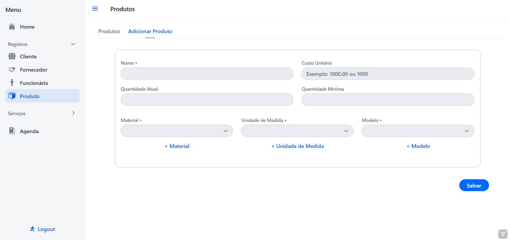
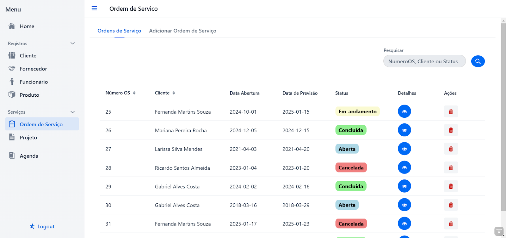

# Marble Business Management System

Web application for managing marble businesses, focusing on operational administration. Built with Java and Vaadin as a Capstone Project (TCC) to streamline operations and provide a clear business overview.

---

## Key Features

- Main Dashboard with: daily service orders, scheduled tasks, low-stock products
- CRUD Modules: service orders, projects, products, tasks, clients, suppliers, employees

---
 
## Technologies Used

- Java 17
- Spring Boot
- Vaadin
- MySQL
- Maven

---

## Video Demo

Watch a demo of the system in action:
[https://youtu.be/ikaWbtQyMxw](https://youtu.be/ikaWbtQyMxw)

---

## System Screenshots

Here are some screenshots of the application.

### Main Dashboard


### Suppliers


### Product


### Service Orders


---

## 📁 Project Structure

```
structura/
|
├── .mvn/
│   └── wrapper/
├── .vscode/
├── database/
│   └── schema.sql
├── docs/
├── src/
│   └── main/
├── .gitignore
├── LICENSE.md
├── README.md
├── mvnw / mvnw.cmd
├── package.json / package-lock.json
├── pom.xml
├── tsconfig.json
├── types.d.ts
└── vite.config.ts
```

---

## How to Run

This is a standard Maven project. To run it from the terminal, type `mvnw` (Windows) or `./mvnw` (Mac & Linux), then open http://localhost:8080 in your browser.
You can also import the project into your preferred IDE like any Maven project.

## Database

The script to create the database is available in the [`/database`](./database/schema.sql) folder.
You can import this file into any local MySQL instance or container to run the project correctly.

## Production Build

To generate a production build, run `mvnw clean package -Pproduction` (Windows) or `./mvnw clean package -Pproduction` (Mac & Linux).
This will create a JAR file containing all dependencies and front-end resources, ready for deployment. The file will be in the `target` folder after the build completes.

After the JAR is generated, you can run it using:
`java -jar target/myapp-1.0-SNAPSHOT.jar`
(Note: replace `myapp-1.0-SNAPSHOT.jar` with your actual JAR file name.)

---

## License
This project is licensed under Creative Commons BY-NC 4.0.
